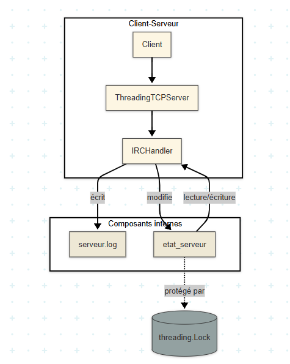

# TP-Serveur-TCP-IP-simple
Axel Pedrero / Simon Lours

## 2.1 Cohérence concurrente et synchronisation

**— Quels types de problèmes de concurrence peuvent apparaître dans ce système multi-clients ?**  
Deux clients modifient un même canal en même temps. il y a donc des pertes de données et l'état est incohérent

**— Que peut-il arriver si deux clients rejoignent ou quittent un canal en même temps ?**  
Si les deux rejoignent, un des deux peut ne pas être ajouter correctement.  
S’ils quittent, il eest possible que le dernier utilisateur reste enregistré ou que le canal ne soit pas mis à jour

**— Votre système est-il vulnérable aux incohérences d’état ou aux conditions de course ? Comment s’en prémunir ?**  
Oui, sans verrou ça serait dangereux. Mais y’a un `threading.Lock`, donc les accès concurrents sont protégés si c’est bien utilisé.

---

## 2.2 Modularité et séparation des responsabilités

**— Quelles sont les grandes responsabilités fonctionnelles de votre application serveur (gestion client, traitement commande, envoi message, logs, persistance…) ?**  
gestion des clients, des pseudos, des canaux, des messages, des logs, et sauvegarde JSON,

**— Peut-on tracer une frontière claire entre logique métier et logique d’entrée/sortie réseau ?**  
Non tout est mélangé dans les méthodes du handler. Commandes, accès à l’état, logs, tout dans les mêmes fonctions

**— En cas d’erreur dans une commande, quelle couche doit réagir ?**  
C’est le handler qui réagit direct. Soit il écrit un message d’erreur, soit il ignore. Y’a pas de couche dédiée pour ça.

---

## 2.3 Scalabilité et capacité à évoluer

**— Si vous deviez ajouter une nouvelle commande (ex : /topic, /invite, /ban), quelle partie du système est concernée ?**  
Faut modifier la méthode `handle()` dans le handler et ajouter une fonction à côté.

**— Que faudrait-il pour que ce serveur fonctionne à grande échelle (plusieurs centaines de clients) ?**  
Changer le système de persistance (pas de JSON), mieux gérer les threads, remplacer les sockets bloquantes, ajouter des queues/messages

**— Quelles limitations structurelles du code actuel empêchent une montée en charge ?**  
JSON pas scalable, pas de base de données,tout en mémoire. Les threads peuvent exploser si y’a trop de clients. Pas de détection fine des erreurs

---

## 2.4 Portabilité de l’architecture

**— Ce serveur TCP pourrait-il être adapté en serveur HTTP ? Quelles parties seraient conservées, quelles parties changeraient ?**  
Pas direct. Faut virer toute la partie socket TCP, refaire l’entrée des commandes. Mais l’état (`etat_serveur`) peut rester. Donc il faut découpler la logique métier

**— Dans une perspective micro-services, quels modules seraient candidats naturels pour devenir des services indépendants ?**  
Gestion des utilisateurs, gestion des canaux, logs, alerte. Tout ça peut être séparé

**— Est-il envisageable de découpler la gestion des utilisateurs de celle des canaux ? Comment ?**  
Oui, faut séparer les structures de données. Créer deux objets ou services distincts. Ils communiquent entre eux via interface claire

---

## 2.5 Fiabilité, tolérance aux erreurs, robustesse

**— Le serveur sait-il détecter une déconnexion brutale d’un client ? Peut-il s’en remettre ?**  
Oui. Si `readline()` retourne vide, il nettoie l’utilisateur. Ça fonctionne globalement !!!!

**— Si un message ne peut pas être livré à un client (socket cassée), le système le détecte-t-il ?**  
Pas vraiment. Le `write()` est dans un `try`, et souvent ça continue même en cas d’erreur

**— Peut-on garantir une livraison ou au moins une trace fiable de ce qui a été tenté/envoyé ?**  
Non. Si un client est déconnecté, le message est perdu. Pas de retry, pas de file, juste un log sur le serveur

---

## 2.6 Protocole : structuration et évolutivité

**— Quelles sont les règles implicites du protocole que vous utilisez ? Une ligne = une commande, avec un préfixe (/msg, /join, etc.) et éventuellement des arguments : est-ce un protocole explicite, documenté, formalisé ?**  
Non. C’est implicite. Ligne texte avec `/commande` + arguments. Pas de doc officielle. Pas de vérif syntaxique poussée

**— Le protocole est-il robuste ? Que se passe-t-il si un utilisateur envoie /msg sans texte ? Ou un /join avec un nom de canal invalide ?**  
Pas toujours géré. Un `/msg` vide passe maispas de vérification stricte. Le serveur répond pas tout le temps

**— Peut-on imaginer une spécification formelle de ce protocole ? Un mini-ABNF, une doc à destination des développeurs de client ?**  
Oui possible. Faut formaliser la syntaxe, faire des règles genre `/commande arg1 arg2`, définir les erreurs

**— Quelle serait la différence structurelle entre ce protocole et un protocole REST ou HTTP ?**  
Ici c’est du texte brut ligne par ligne. REST c’est structuré, avec verbe HTTP, JSON, status code. Ici, rien de tout ça.

---------------------------------------------------------------------------------------------

---------------------------------------------------------------------------------------------

---------------------------------------------------------------------------------------------

## 2.1 Analyse du code

### 1. Qui traite les commandes ?

**— Quelle fonction interprète /msg, /join, etc. ?**  
C’est la méthode `handle()` dans la classe `IRCHandler`. Elle lit chaque ligne envoyée par le client et appelle la fonction qui correspond à la commande.

**— Qui accède à la mémoire partagée etat_serveur ?**  
Toutes les fonctions comme `set_pseudo()`, `rejoindre_canal()`, `envoyer_message()` accèdent à `etat_serveur`. Chaque accès est protégé par un `threading.Lock`.

---

### 2. Où sont stockées les infos ?

**— Où est enregistré le canal courant d’un utilisateur ?**  
Dans `etat_serveur["utilisateurs"][pseudo]["canal"]`.

**— Où sont les flux de sortie (wfile) associés à chaque client ?**  
Dans `etat_serveur["utilisateurs"][pseudo]["wfile"]`. Il est mis au moment du `/nick`.

---

### 3. Qui peut planter ?

**— Que se passe-t-il si un client quitte sans envoyer /quit ?**  
Si le client ferme juste la connexion, `readline()` renvoie vide, donc le handler s’arrête et fait le nettoyage quand même. Pas besoin d’envoyer `/quit`.

**— Qu’arrive-t-il si un write() échoue ? Est-ce détecté ?**  
Pas vraiment. C’est souvent mis dans un `try/except` avec juste un `continue`. Donc l’échec est silencieux, pas de message d’erreur.

**— Est-ce qu’un canal vide est supprimé ?**  
Non. Quand un utilisateur quitte, il est retiré du canal, mais le canal reste dans `etat_serveur["canaux"]`, même vide. Pas de suppression automatique.

## 2.2 À produire

### 2.2.1 Un schéma d’architecture fonctionnelle

